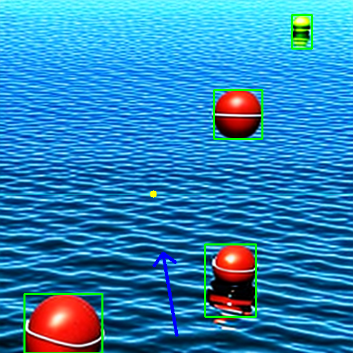

````markdown
# Sea Object Detection and Drone Direction Planning

This project generates synthetic sea images and applies a simple computer vision pipeline to detect floating objects and estimate a safe direction for drone navigation.

The pipeline first generates realistic sea images using a diffusion model. Then, it applies HSV-based thresholding to separate sea/sky regions from possible floating objects such as buoys or debris. Detected object regions are cleaned using morphological operations, bounding boxes are extracted, and a scan-line based method is used to choose a safe heading direction for the drone.

## Pipeline

1. Generate synthetic sea images using `stabilityai/sd-turbo`
2. Detect potential floating objects using HSV thresholding
3. Extract bounding boxes around detected objects
4. Choose a safe drone direction by finding clear gaps between obstacles
5. Save visual results with bounding boxes and heading arrows

## Example Output

<div align="center">



</div>

## Main Features

- Synthetic image generation using Stable Diffusion Turbo
- HSV-based threshold object detection
- Noise removal using morphological operations
- Bounding box extraction with connected components
- Scan-line based gap selection for drone heading estimation
- Visualization of detected objects and selected direction

## How to Run

```bash
python main.py
````

The number of generated images can be changed inside `main.py`:

```python
main(number_of_images=5)
```

## Output Folders

* `Images/Original/` — generated images
* `Images/Threshold/` — binary object masks
* `Images/Bounding_boxes/` — detected objects with bounding boxes
* `Images/Bounding_boxes_Arrow/` — final result with drone heading direction

```
```
